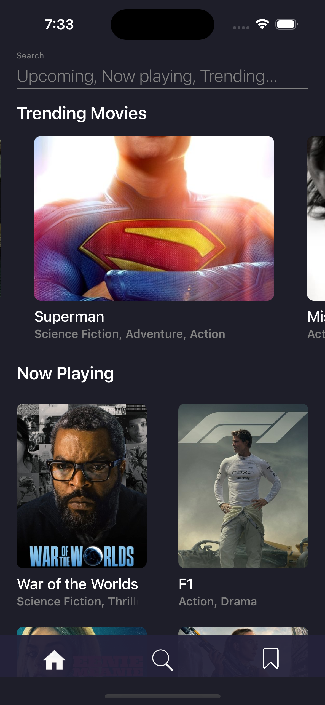

MovieApp - Screenshots

## 📱 App Screenshots

### Home Screen

### Home Screen (resized)

MovieApp is an iOS application built in Swift that allows users to browse trending and now-playing movies, search for movies in real-time, bookmark their favorites, and share movie details via deep-linking. The app is designed to work offline by persisting data in Core Data and caching images in the file system.
🏗 Architecture
	•	MVVM (Model-View-ViewModel) architecture is used for clean separation of concerns.
	•	Core Data is used to store movie details for offline support.
	•	File system is used for storing movie poster images.
	•	Caching is implemented with a Time-to-Live (TTL) of 1 day for faster image loading. If a cached image is not found, it falls back to the file system.
	•	DispatchWorkItem is used for debouncing API calls in the search feature.
	•	Cache expiry ensures images are refreshed periodically.

📱 Features
1. Home Tab
	•	Contains a parent scroll view with two collection views:
	◦	Top horizontal collection view: Trending movies
	◦	Bottom vertical collection view: Now playing movies
    ◦	Both horizontal and vertical collection views are paginated ,i.e. infinite scrolling:)
	•	Users can tap a movie to see its details in MovieDetailsViewController.
	•	Movie details allow users to:
	◦	Bookmark a movie
	◦	Read the overview
	◦	Share the movie using deep-linking
	•	Offline support: Movie data is persisted in Core Data and poster images are cached.
2. Search Tab
	•	Real-time movie search as the user types.
	•	Debouncing API calls using DispatchWorkItem to prevent unnecessary network requests.
	•	Users can tap a searched movie to view details.
	•	Pull-to-refresh is supported (API called with page=1).
3. Saved Tab
	•	Displays all bookmarked movies in SavedMoviesViewController.
	•	Users can un-save movies directly from this list.
	•	The list refreshes automatically when changes occur.
	•	Pull-to-refresh supported.

🔧 How Data Works
	•	Movies & Details: Stored in Core Data for offline access.
	•	Poster Images: Stored in the File System.
	•	Image Caching:
	◦	Cached images are loaded first.
	◦	If cache is expired or missing, images are fetched from the file system.
	◦	Cache TTL = 1 day.
🛠 Technical Details
	•	Language: Swift
	•	Architecture: MVVM
	•	Offline Support: Core Data + File system + Caching
	•	Debounced API Calls: Using DispatchWorkItem
	•	Cache Expiry: 1 day TTL for images
	•	Deep-linking: Movie details can be opened via URL
📂 File Structure
	•	HomeViewController.swift – Home screen with trending & now-playing movies
	•	MovieDetailsViewController.swift – Movie detail view, bookmark & share functionality
	•	SavedMoviesViewController.swift – List of saved movies with remove option
	•	SearchViewController.swift – Real-time search with debounced API calls
	•	Models/ – Core Data and API models
	•	ViewModels/ – MVVM view models for each screen
	•	Services/ – API, caching, and persistence services
	•	Views/ – Custom UI components and reusable views
